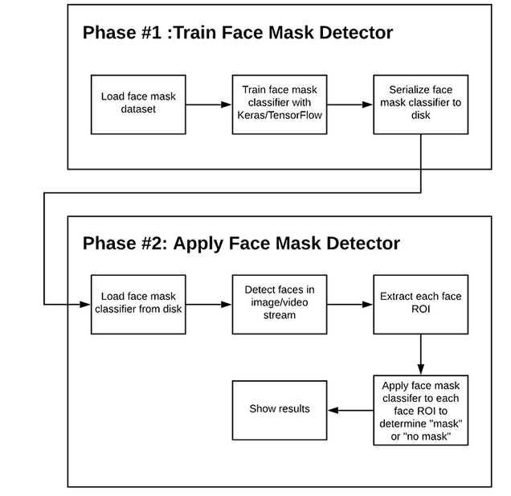
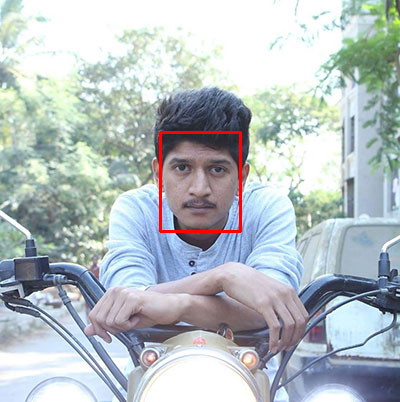
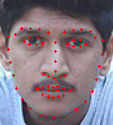
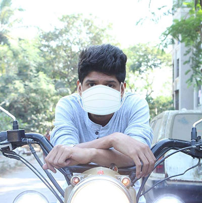
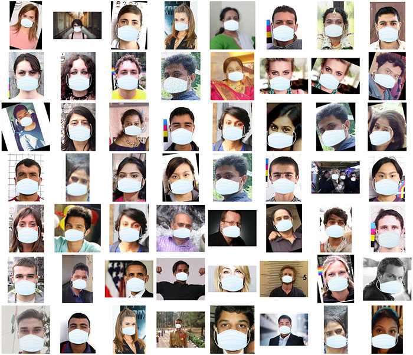

# COVID19-Face-Mask-Detector
COVID-19: Face Mask Detector with OpenCV, Keras/TensorFlow, and Deep Learning

## 1 - Project Architecture 



In order to train a custom face mask detector, we need to break our project into two distinct phases, each with its own respective sub-steps (as shown by Figure 1 above):

1- Training: Here we’ll focus on loading our face mask detection dataset from disk, training a model (using Keras/TensorFlow) on this dataset, and then serializing the face mask detector to disk

2- Deployment: Once the face mask detector is trained, we can then move on to loading the mask detector, performing face detection, and then classifying each face as with_mask or without_mask

We’ll review each of these phases and associated subsets in detail in the remainder of this tutorial, but in the meantime, let’s take a look at the dataset we’ll be using to train our COVID-19 face mask detector.

## 2 - Dataset 

This dataset consists of 1,376 images belonging to two classes:

    with_mask: 690 images
    without_mask: 686 images

**Our goal is to train a custom deep learning model to detect whether a person is or is not wearing a mask.**

### How was our face mask dataset created?

    Taking normal images of faces
    Then creating a custom computer vision Python script to add face masks to them, thereby creating an artificial (but still real-world applicable) dataset
    This method is actually a lot easier than it sounds once you apply facial landmarks to the problem.

Facial landmarks allow us to automatically infer the location of facial structures, including:

    1)Eyes
    2)Eyebrows
    3)Nose
    4)Mouth
    5)Jawline

To use facial landmarks to build a dataset of faces wearing face masks, we need to first start with an image of a person not wearing a face mask:


From there, we apply face detection to compute the bounding box location of the face in the image:



Once we know where in the image the face is, we can extract the face Region of Interest (ROI):


And from there, we apply facial landmarks, allowing us to localize the eyes, nose, mouth, etc.:



Next, we need an image of a mask (with a transparent background) such as the one below:


This mask will be automatically applied to the face by using the facial landmarks (namely the points along the chin and nose) to compute where the mask will be placed.
The mask is then resized and rotated, placing it on the face:



We can then repeat this process for all of our input images, thereby creating our artificial face mask dataset:



And with this, we can optain our complete dataset for images with_mask and without_mask:


However, there is a caveat you should be aware of when using this method to artificially create a dataset!

If you use a set of images to create an artificial dataset of people wearing masks, you cannot “re-use” the images without masks in your training set — you still need to gather non-face mask images that were not used in the artificial generation process!

If you include the original images used to generate face mask samples as non-face mask samples, your model will become heavily biased and fail to generalize well. Avoid that at all costs by taking the time to gather new examples of faces without masks.

## 3 - Project Structure

├── dataset<br/>
│   ├── with_mask [690 entries]<br/>
│   └── without_mask [686 entries]<br/>
├── face_detector<br/>
│   ├── deploy.prototxt<br/>
│   └── res10_300x300_ssd_iter_140000.caffemodel<br/>
├── detect_mask_image.py<br/>
├── detect_mask_video.py<br/>
├── mask_detector.model<br/>
├── plot.png<br/>
└── train_mask_detector.py<br/>

## 4 - Training the COVID-19 face mask detector with Keras/TensorFlow

open up a terminal, and execute the following command:


```python
python train_mask_detector.py --dataset dataset
```


Looking at the resulting plot, we can see there are little signs of overfitting, with the validation loss lower than the training loss.

## 5 - Implementing our COVID-19 face mask detector in real-time video streams with OpenCV

open up a terminal, and execute the following command:


```python
python detect_mask_video.py
```


Here, you can see that our face mask detector is capable of running in real-time (and is correct in its predictions as well).

## 6 - Suggestions for improvement

As you can see from the results sections above, our face mask detector is working quite well despite:
    
    Having limited training data
    The (with_mask) class being artificially generated.


To improve our face mask detection model further, you should gather actual images (rather than artificially generated images) of people wearing masks.
While our artificial dataset worked well in this case, there’s no substitute for the real thing.

Secondly, you should also gather images of faces that may “confuse” our classifier into thinking the person is wearing a mask when in fact they are not — potential examples include shirts wrapped around faces, bandana over the mouth, etc.

All of these are examples of something that could be confused as a face mask by our face mask detector.